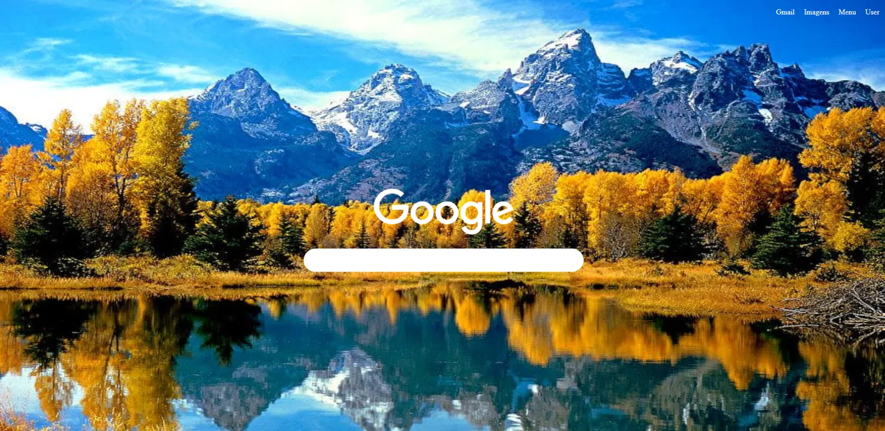

# Desafio Google 🔍

Clone da página inicial do Google, desenvolvido como desafio prático da 
disciplina de Design de Sistemas Web (curso de ADS).

## 🎯 Objetivo

Reproduzir a estrutura visual da homepage do Google, aplicando conceitos 
de HTML semântico e CSS puro — sem uso de frameworks.

## 🛠️ Tecnologias

- HTML5
- CSS3

## ✨ O que foi praticado

- Estruturação de layout com **Flexbox**
- Centralização de elementos (vertical e horizontal)
- Estilização de campo de busca (`border-radius`, dimensões customizadas)
- Uso de imagem de fundo (`background-image`)
- Organização de barra de navegação superior

## 📂 Estrutura do projeto

```
Desafio-Google/
├── img/          # Imagens utilizadas (logo)
├── index.html    # Estrutura da página
└── style.css     # Estilização
```

## 👀 Preview



## 🚀 Como visualizar

**Opção 1 — Download direto (mais simples)**
1. Clique no botão verde "Code" → "Download ZIP"
2. Extraia o arquivo em qualquer pasta
3. Dê duplo clique no `index.html` — ele abre no navegador

**Opção 2 — Via Git**
```bash
git clone https://github.com/izaamc/Desafio-Google.git
cd Desafio-Google
```
Depois, abra o arquivo `index.html` no navegador.

---

Projeto acadêmico — parte da formação em Análise e Desenvolvimento de Sistemas.
